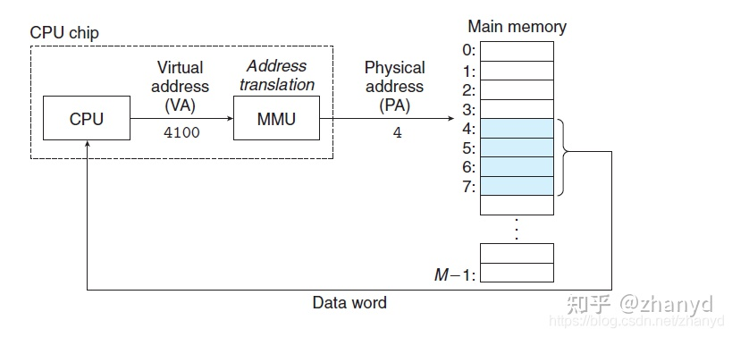
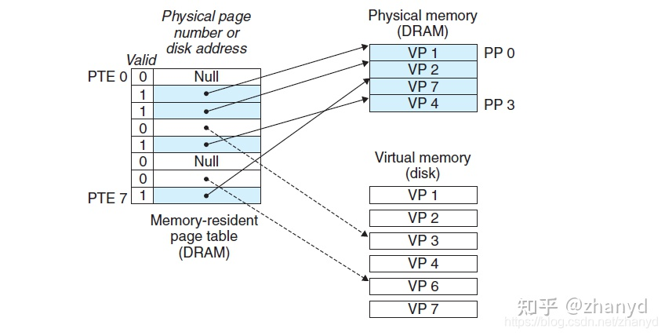

# 虚拟内存

## 1. 虚拟内存的原理

1. 虚拟内存是计算机系统内存管理的一种技术。
2. 使得程序**认为它拥有连续可用的内存**，而实际上，它通常**是被分隔成多个物理内存碎片**，还**有一部分赞数存储在外部磁盘存储器上**，在需要时进行数据交换
3. 使得真正的物理内存的使用更有效率
4. 虚拟内存的最大空间是计算机的最大寻址空间，不受内存大小的限制，能提供比内存更大的地址空间

## 2.虚拟内存的工作原理

* 创建一个进程时，操作系统（32位系统）会为该进程分配一个4GB的虚拟内存（在32系统中，地址的大小是32bit，因此最大寻址空间为2^32 = 4GB；64位是2^64）
* 一个进程用到的虚拟地址是由内存区域表管理的，实际用不到4G；而**用到的内存区域，会通过页表映射到物理内存**。所以**每个进程都可以使用同样的虚拟内存地址而不冲突**，因为他们的物理地址实际上是不同的。
* CPU访问虚拟内存地址时，需要经过地址翻译成物理地址才能访问。（通过专用的硬件内存管理单元MMU）。

* 虚拟内存被分为一块块固定的大小，称为虚拟页（VP），对应的物理内存也被分成一块块同样的大小，称为物理页（PP）。**磁盘和内存之间是以页为单位进行数据交换的**。

* CPU通过**页表**记录某个虚拟也是否缓存数据、数据存储在内存还是在磁盘。

## 3. 页命中

当CPU要访问PTE2（箭头所指的位置）的数据时，发现valid标志位为1，所以表示该虚拟页已经被缓存了，由于页表中的地址指向内存中的VP2数据块，所以CPU直接从内存中读取数据VP2，这种情况就叫做页命中。

## 4. 缺页

当CPU要访问PTE3（箭头所指的位置）的数据时，发现valid标志位为0，所以表示该虚拟页未被缓存，这时会触发一个缺页异常，cup根据页表第二列的指针找到磁盘中对应的数据块VP3，然后根据规则选择一个内存中的牺牲页，把VP3覆盖到内存中。

上图中的内存中的vp4被替换成了VP3，valid的值从0变成1。

缺页异常返回后，会重启缺页指令，并更新虚拟地址，CPU再次访问PTE3的时候就能命中页，取到数据了。

## 5. 总结

当每个进程创建的时候，内核会为每个进程分配虚拟内存，这个时候数据和代码还在磁盘上，当运行到对应的程序时，进程去寻找页表，如果发现页表中地址没有存放在物理内存上，而是在磁盘上，于是发生缺页异常，于是将磁盘上的数据拷贝到物理内存中并更新页表，下次再访问该虚拟地址时就能命中了。
